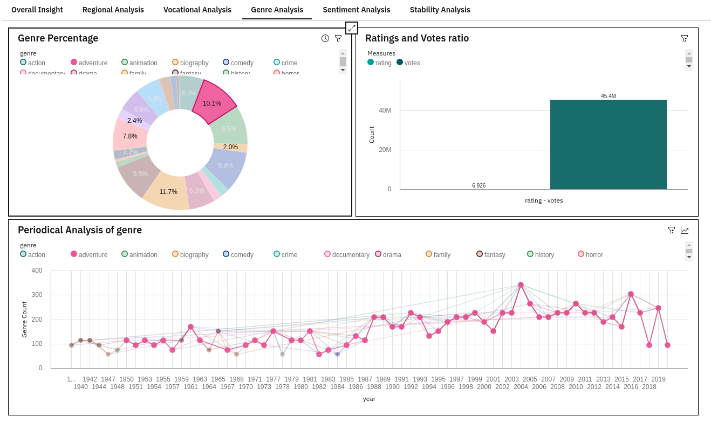

# IBM_Hack_Challenge_21

This is the document for hackathon by ibm. Over  62 million people by 2020 have an OTT subscription. Youtube is one of the most watched or visited websites. Terabytes of data are streamed each year through OTT platforms. This large numbers will draw huge attention among people about the significance of OTT platforms. Majority of people love OTT platforms because it's “ any time you can watch”. One just needs a stable internet connection and with advancement of 5g there is no doubt that business of OTT platforms will grow henceforth. But recently all OTT platforms are slowly becoming production companies also. So it is important to understand the current market situations. New OTT platforms also need to know the stability of these platforms so they can take efficient business decisions for the future. The major problems with OTT platforms is that since they stream content a content may gain huge success later. Sameway some content produced in the past needed to be added in the platforms to make revenue. Shows like F.R.I.E.N.D.S are still trending. On the other hand Big Bang Theory gained more viewers in later seasons. The best way to deal with it is using an analysis tool. Analysis tools help us to understand trends in data. For new shows, effective advertisement can help to reduce such a problem. Each shows much reach to people with proper language. OTT platforms should be able to use these tools to understand modern trends in the genre. So a dashboard containing all details will help OTT platforms to take effective decision.

In this project we will be developing a dashboard which will help ott platforms to understand “What is being streamed” and “Why is being streamed”. The largely collected data will help analysts to create reports and make important decisions. So in his project the main idea or work is related to creating a meaningful visualization of the data so that it can be used by  other team members. The documentation provided with the dashboard will help one to go through it and make meaningful decisions in their business. The dashboard is made carefully with a concern about existing ott platforms as well as newcomers. One can also get the market stability of the current ott platforms because absence of perfect competition can result in monopoly.

---

## Dashboard

### **Video Link :** 